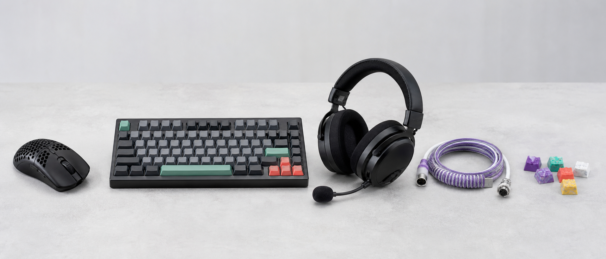
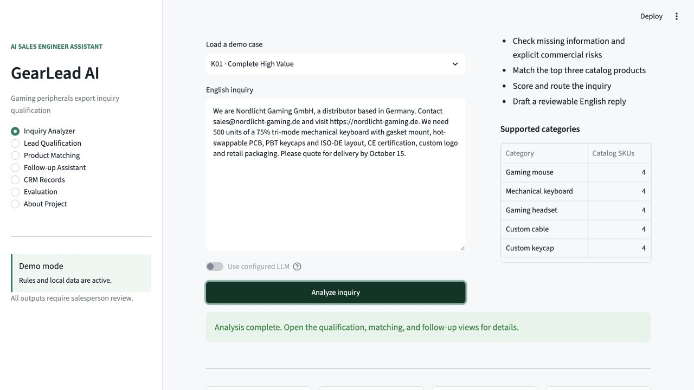
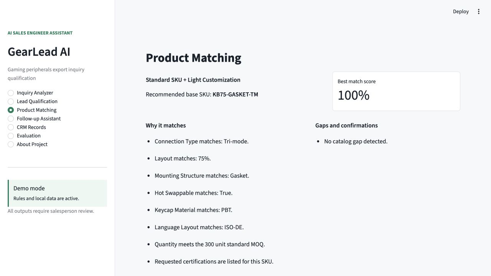
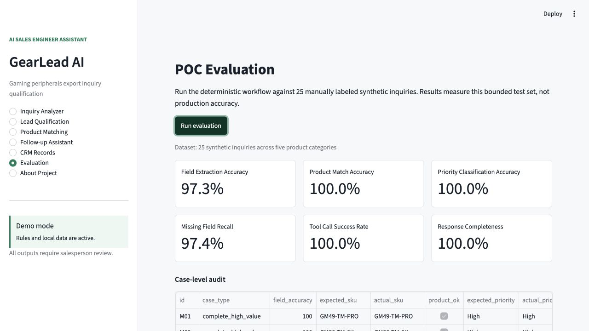
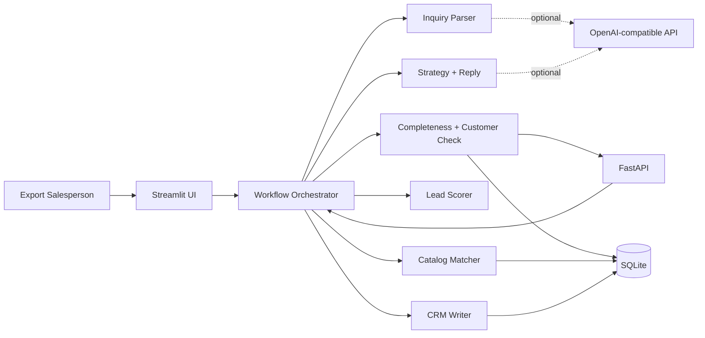
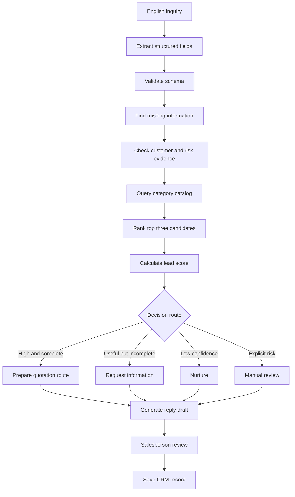

# GearLead AI

**AI Sales Engineer Assistant for Gaming Peripheral Exporters**

GearLead AI is an agent-based B2B inquiry qualification and product matching POC for gaming peripheral exporters. It turns an English buyer inquiry into structured requirements, catalog matches, a transparent lead score, a follow-up route, and a reviewable English reply draft.



> This proof of concept supports AI-assisted inquiry qualification and product matching. It does not provide legal, financial, trade compliance, or credit risk advice. All generated replies are drafts for salesperson review.

## Why This Project Exists

Export salespeople must interpret incomplete English inquiries, understand product-specific parameters, check MOQ and customization feasibility, prioritize leads, and prepare a professional first response. The work is repetitive but cannot be delegated to a language model alone because catalog facts, scoring thresholds, and commercial safeguards must remain deterministic and explainable.

GearLead AI models the bounded workflow from **inquiry received** to **first response decision** for five product categories:

- Gaming mice
- Mechanical keyboards
- Gaming headsets
- Custom keyboard cables
- Custom keycaps

## Core Capabilities

- Paste an English inquiry or upload TXT/DOCX
- Extract buyer, purchase, technical, customization, and commercial fields
- Keep customer country, target market, and delivery destination separate
- Validate structured output with Pydantic
- Find missing qualification information
- Separate information-quality notes, commercial warnings, and explicit risks
- Return the top three products from a 20-SKU SQLite catalog
- Block standard-SKU decisions when a product hard constraint conflicts
- Classify Standard SKU, Light Customization, ODM Review, or No Match
- Calculate a six-dimension, 100-point lead score
- Route to High, Medium, Low, or Risk Review
- Generate a strategy-specific English reply with a mandatory review notice
- Save reviewed results to a local CRM table
- Run a case-level evaluation against 25 manually labeled synthetic inquiries
- Expose analysis, product, and CRM capabilities through five FastAPI endpoints

## Demo Screens

| Inquiry analysis | Product matching |
|---|---|
|  |  |



## Architecture



The architecture deliberately separates responsibilities:

| Component | Responsibility | Why |
|---|---|---|
| LLM or rule parser | Understand open-ended English | Handles language variation |
| Pydantic | Validate the inquiry schema | Prevents malformed downstream data |
| SQLite catalog | Store product and customer facts | Keeps recommendations grounded |
| Matching rules | Compare technical requirements | Makes product recommendations auditable |
| Scoring engine | Apply fixed business weights | Keeps priority decisions explainable |
| Human review | Confirm commercial commitments | Prevents unsafe automation |

## Agent Workflow



## Product Matching

The matcher queries only products in the detected category, checks explicitly requested specifications, MOQ, certifications, markets, and customization support, then returns the top three candidates with positive evidence and gaps. Category-specific hard constraints are checked before a standard match can be returned.

The decision types are:

1. `Standard SKU Match`
2. `Standard SKU + Light Customization`
3. `ODM Feasibility Review`
4. `No Suitable Match`

Logo, color, and packaging are treated as light customization when the base SKU supports them. Firmware, new tooling, new molds, original artwork, unsupported language layouts, and structural changes trigger an engineering feasibility route.

## Lead Score

| Dimension | Maximum |
|---|---:|
| Customer credibility | 20 |
| Requirement clarity | 20 |
| MOQ fit | 15 |
| Product/customization feasibility | 20 |
| Commercial value | 15 |
| Urgency | 10 |
| **Total** | **100** |

An explicit risk signal overrides the numeric total and routes the inquiry to `Risk Review`. Scores assist ordering; they never automatically reject a buyer.

## POC Evaluation

The repository includes 25 manually labeled synthetic inquiries: five mice, six keyboards, four headsets, five cables, and five keycap cases. The set contains complete, incomplete, ODM, low-quality, and risk examples.

Current deterministic baseline:

| Metric | Result | PRD target |
|---|---:|---:|
| Basic field extraction accuracy | 98.7% | >= 80% |
| Product match accuracy | 100.0% | >= 80% |
| Priority classification accuracy | 100.0% | >= 75% |
| Missing field recall | 97.4% | >= 80% |
| Tool call success rate | 100.0% | >= 95% |
| Response completeness | 100.0% | >= 80% |

These numbers describe a small, curated synthetic POC set. They are not claims about production performance or unseen real-world inquiries.

## Tech Stack

- Python 3.10+
- Streamlit
- FastAPI and Uvicorn
- SQLite
- Pydantic
- Pandas
- python-docx
- OpenAI-compatible Chat Completions API, optional
- pytest

## Repository Layout

```text
gearlead-ai/
├── app.py
├── api.py
├── assets/
├── data/
├── docs/
├── gearlead/
│   ├── prompts/
│   ├── services/
│   └── tools/
├── tests/
├── .env.example
├── requirements.txt
└── README.md
```

## Local Setup

```bash
python3 -m venv .venv
source .venv/bin/activate
pip install -r requirements.txt
cp .env.example .env
streamlit run app.py
```

Start the API in another terminal:

```bash
source .venv/bin/activate
uvicorn api:app --reload
```

Open `http://127.0.0.1:8000/docs` for Swagger. The API provides:

- `GET /health`
- `POST /api/v1/inquiries/analyze`
- `GET /api/v1/products`
- `POST /api/v1/leads`
- `GET /api/v1/leads`

The default `.env.example` uses `DEMO_MODE=true`. No API key is required for the complete deterministic workflow.

To enable an OpenAI-compatible provider:

```text
OPENAI_API_KEY=
OPENAI_MODEL=gpt-4o-mini
OPENAI_BASE_URL=https://api.openai.com/v1
DEMO_MODE=false
```

Never commit `.env` or an API key.

## Tests

```bash
pytest
```

The suite covers schema validation, all five product categories, separate geography fields, hard constraints, negative requirements, quality-versus-risk routing, score caps, workflow completion, CRM persistence, FastAPI endpoints, and evaluation thresholds.

## Demo Flow

1. Open `Inquiry Analyzer` and load case `K01`.
2. Run the analysis and inspect the structured JSON and tool trace.
3. Open `Lead Qualification` to explain the six score dimensions.
4. Open `Product Matching` to compare the top three candidates.
5. Open `Follow-up Assistant` to review the route, questions, and email.
6. Save the reviewed result to `CRM Records`.
7. Run `Evaluation` to show the bounded POC test results.

## Safety and Scope

GearLead AI does not:

- Send emails automatically
- Produce a final price or promise a delivery date
- Make legal, sanctions, certification, credit, or trade-compliance decisions
- Query real companies or external CRMs
- Replace salesperson or engineering review

## Documentation

- [Project overview](docs/01_project_overview.md)
- [Business background](docs/02_business_background.md)
- [Functional requirements](docs/03_functional_requirements.md)
- [System architecture](docs/04_system_architecture.md)
- [Agent workflow](docs/05_agent_workflow.md)
- [Database design](docs/06_database_design.md)
- [Product knowledge base](docs/07_product_knowledge_base.md)
- [Scoring and matching](docs/08_scoring_and_matching.md)
- [Testing plan](docs/09_testing_plan.md)
- [Deployment](docs/10_deployment.md)
- [Customer discovery, Chinese](docs/12_customer_discovery_zh.md)
- [AI solution proposal, Chinese](docs/13_solution_proposal_zh.md)
- [POC report, Chinese](docs/14_poc_report_zh.md)

## Roadmap

- Validate parser and matching rules on anonymized real inquiries
- Add product PDF retrieval with source citations
- Add role-based approval and an audit trail
- Connect a sandbox CRM and email draft API
- Add multilingual inquiry support
- Monitor extraction drift, override rate, and salesperson acceptance

## Resume Bullet

> Developed GearLead AI, an agent-based B2B inquiry qualification and product matching system for a simulated gaming peripherals exporter. The system extracts structured requirements from English inquiries, applies category-specific hard constraints against a 20-SKU SQLite catalog, separates qualification warnings from commercial risks, and generates human-reviewed follow-up strategies and English response drafts. Exposed the workflow through five FastAPI endpoints and built a 25-case labeled POC regression set.
