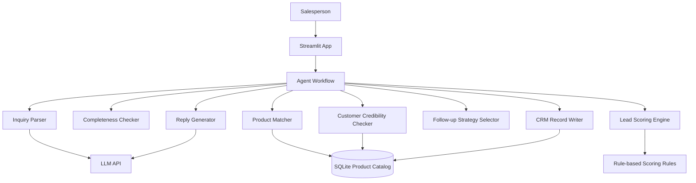
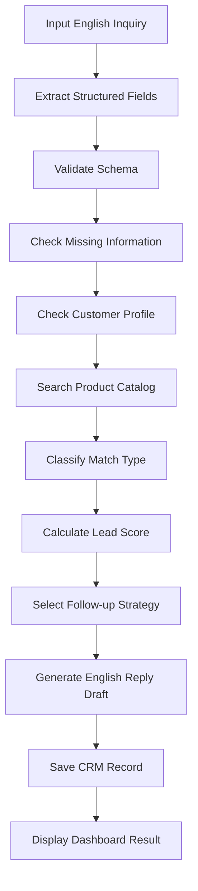

# GearLead AI 项目计划书 / PRD

## 0. 给 Codex 的一句话任务

请根据本文档，从零实现一个中等难度、可运行、可展示、可上传 GitHub 的 AI 项目：

> **GearLead AI — 面向电竞外设出口企业的英文询盘资格评估与产品匹配 Agent**

项目目标是构建一个面向 B2B 电竞外设出口企业的 AI Sales Engineer Assistant。系统能够分析海外客户英文询盘，提取采购需求，匹配鼠标、键盘、耳机、客制化线材、客制化键帽等产品能力，评估询盘优先级和业务风险，并生成可由外贸业务员审核后发送的英文跟进邮件草稿。

项目必须体现：

- 外贸业务理解
- 电竞外设产品知识
- Agent 工作流
- 结构化信息提取
- 规则评分引擎
- 产品匹配逻辑
- 模拟 CRM 记录
- Streamlit 可视化 Demo
- 完整 GitHub README 和文档

项目难度控制在中等，不做真实邮箱集成、真实 CRM 集成、真实企业征信、自动报价、自动发邮件或复杂模型训练。

---

## 1. 项目基本信息

### 1.1 中文名称

面向电竞外设出口企业的英文询盘资格评估与产品匹配 Agent

### 1.2 英文名称

GearLead AI: An Agent-Based B2B Inquiry Qualification and Product Matching System for Gaming Peripherals Exporters

### 1.3 简历推荐名称

GearLead AI — AI Sales Engineer Assistant for Gaming Peripheral Exporters

### 1.4 一句话介绍

GearLead AI 是一个面向电竞外设 B2B 出口企业的 AI Agent 系统，能够从英文客户询盘中提取采购需求，匹配产品与定制能力，评估询盘价值与风险，并生成可解释的跟进策略和英文回复草稿。

### 1.5 项目定位

本项目不是普通的邮件生成器，也不是通用聊天机器人，而是一个模拟外贸业务员和售前工程师工作流的 AI 解决方案原型。系统聚焦“收到英文询盘后到形成第一次专业回复和跟进决策”这一具体业务流程。

---

## 2. 项目背景

### 2.1 行业背景

电竞外设出口企业通常面向海外分销商、品牌商、电商卖家、游戏俱乐部周边品牌和区域代理销售产品。常见产品包括：

- 电竞鼠标
- 机械键盘
- 电竞耳机
- 客制化键盘线材
- 客制化键帽

这些产品具备明显的 B2B 外贸特点：

- 询盘主要使用英文；
- 客户来自不同国家和地区；
- 产品参数多且专业；
- OEM、ODM、私牌包装需求常见；
- MOQ、交期、认证、样品和定制能力会直接影响报价和跟进策略；
- 新业务员难以快速判断询盘价值和产品匹配度。

### 2.2 业务痛点

外贸业务员收到询盘后，通常需要人工完成以下工作：

1. 阅读英文询盘；
2. 识别客户国家、公司类型和采购意图；
3. 提取产品类型、参数、数量、预算、认证和定制要求；
4. 判断信息是否完整；
5. 判断客户是否值得优先跟进；
6. 查询产品目录；
7. 判断是标准 SKU、轻度定制，还是 ODM 深度定制；
8. 发现缺失信息和潜在风险；
9. 生成英文回复；
10. 记录客户和跟进动作。

痛点包括：

- 英文询盘信息不完整，人工筛选耗时；
- 新业务员不熟悉鼠标、键盘、耳机、线材、键帽的关键参数；
- 产品匹配依赖经验，容易漏掉合适 SKU；
- 对低质量询盘、高风险询盘、高价值询盘的处理标准不统一；
- 回复邮件质量参差不齐；
- 询盘记录没有形成结构化资产。

### 2.3 AI 解决方案机会

该业务流程适合用 Agent 实现，因为它不是单一文本生成任务，而是由多个可拆解步骤组成：

```text
英文询盘输入
  -> 结构化字段提取
  -> 缺失信息检查
  -> 客户可信度检查
  -> 产品数据库查询
  -> 匹配类型判断
  -> 询盘评分
  -> 跟进策略选择
  -> 英文邮件草稿生成
  -> CRM 记录保存
```

本项目要展示的是“业务流程自动化 + 大模型理解能力 + 规则引擎 + 产品知识库 + 人工审核”的组合能力。

---

## 3. 目标用户

### 3.1 核心用户

消费电子和电竞外设出口企业的外贸业务员。

### 3.2 辅助用户

- 外贸销售主管
- 新入职外贸业务员
- 销售运营人员
- 外贸企业负责人
- 售前工程师或产品支持人员

### 3.3 用户核心任务

用户希望在收到一封英文询盘后，快速知道：

- 客户是谁；
- 来自哪个国家；
- 询盘是否真实；
- 客户想买什么；
- 关键参数是否完整；
- 采购数量是否达到 MOQ；
- 是否需要 OEM、ODM 或包装定制；
- 当前产品库是否能匹配；
- 应该优先跟进还是普通回复；
- 回复邮件应该怎么写；
- 下一步该问客户哪些问题。

---

## 4. 项目范围与边界

### 4.1 第一版覆盖范围

产品范围仅覆盖五类电竞外设：

1. 电竞鼠标
2. 机械键盘
3. 电竞耳机
4. 客制化键盘线材
5. 客制化键帽

输入范围：

- 直接粘贴英文询盘文本；
- 上传 `.txt` 文件；
- 上传 `.docx` 文件。

输出范围：

- 询盘结构化解析；
- 信息完整度检查；
- 客户可信度检查；
- 产品推荐；
- 匹配类型判断；
- 询盘评分；
- 优先级分类；
- 风险提示；
- 英文回复草稿；
- 下一步跟进行动；
- CRM 模拟记录；
- 测试报告。

### 4.2 第一版不做的能力

为维持中等难度，以下能力明确不做：

- 不自动读取 Gmail、Outlook 或企业邮箱；
- 不自动发送邮件；
- 不接入真实 CRM；
- 不生成最终成交价格；
- 不自动承诺交期；
- 不查询真实海外企业征信；
- 不做国际制裁名单筛查；
- 不做海关、法律或金融合规结论；
- 不自动签合同；
- 不生成工程图纸；
- 不计算真实模具成本；
- 不训练模型；
- 不做多租户权限系统；
- 不做复杂微服务架构。

### 4.3 人工审核边界

所有邮件和业务建议都必须标记为：

```text
Draft for salesperson review.
```

系统只能辅助排序、分析和生成草稿，不能替代业务员最终判断。

---

## 5. 成功标准

项目完成后应满足：

- 本地可以运行 Streamlit Demo；
- 能导入或初始化模拟产品库、客户库和 CRM 数据；
- 能处理至少 25 封模拟英文询盘；
- 能输出结构化 JSON；
- 能基于规则和产品库完成可解释评分；
- 能区分标准 SKU、轻度定制、ODM 深度定制、无法匹配；
- 能生成不同策略的英文回复草稿；
- 能保存询盘记录；
- README 清晰展示项目背景、功能、架构、安装、运行和 Demo；
- `docs/` 中包含 PRD、架构、数据模型、测试说明等文档；
- GitHub 仓库结构专业，适合作为作品集展示。

---

## 6. 技术栈

### 6.1 推荐技术栈

| 模块 | 技术 |
|---|---|
| 语言 | Python 3.10+ |
| 前端 | Streamlit |
| 数据库 | SQLite |
| 数据处理 | Pandas |
| 数据校验 | Pydantic |
| LLM 调用 | OpenAI API 或 DeepSeek API |
| Agent 编排 | 原生工具函数编排，LangGraph 可选 |
| 文档解析 | python-docx |
| 配置 | `.env` + YAML |
| 图表 | Plotly |
| 测试 | pytest |
| 代码规范 | ruff 或 black，可选 |

### 6.2 难度控制建议

优先实现稳定、可解释、可演示的版本。不要为了展示复杂度引入过多框架。

Agent 编排第一版可以用明确的 Python workflow 实现：

```text
parse_inquiry()
  -> check_completeness()
  -> check_customer_profile()
  -> match_products()
  -> score_lead()
  -> select_strategy()
  -> generate_reply()
  -> save_crm_record()
```

如时间充足，再用 LangGraph 重构为图式工作流。

---

## 7. 推荐项目目录结构

```text
gearlead-ai/
├── README.md
├── pyproject.toml
├── requirements.txt
├── .env.example
├── .gitignore
├── app.py
├── data/
│   ├── seed_products.csv
│   ├── seed_customers.csv
│   ├── sample_inquiries.jsonl
│   └── evaluation_gold.json
├── docs/
│   ├── 01_project_overview.md
│   ├── 02_business_background.md
│   ├── 03_functional_requirements.md
│   ├── 04_system_architecture.md
│   ├── 05_agent_workflow.md
│   ├── 06_database_design.md
│   ├── 07_product_knowledge_base.md
│   ├── 08_scoring_and_matching.md
│   ├── 09_testing_plan.md
│   └── 10_deployment.md
├── gearlead/
│   ├── __init__.py
│   ├── config.py
│   ├── database.py
│   ├── schemas.py
│   ├── llm_client.py
│   ├── workflow.py
│   ├── tools/
│   │   ├── __init__.py
│   │   ├── inquiry_parser.py
│   │   ├── completeness_checker.py
│   │   ├── customer_checker.py
│   │   ├── product_matcher.py
│   │   ├── lead_scorer.py
│   │   ├── strategy_selector.py
│   │   ├── reply_generator.py
│   │   └── crm_writer.py
│   ├── services/
│   │   ├── product_service.py
│   │   ├── customer_service.py
│   │   └── evaluation_service.py
│   └── prompts/
│       ├── inquiry_extraction.md
│       ├── reply_generation.md
│       └── risk_review.md
├── tests/
│   ├── test_scoring.py
│   ├── test_product_matching.py
│   ├── test_schema_validation.py
│   └── test_workflow.py
└── screenshots/
    └── .gitkeep
```

---

## 8. 系统架构

### 8.1 架构说明

系统采用本地单体应用架构：

- Streamlit 负责页面交互；
- Python workflow 负责任务编排；
- LLM 负责英文询盘理解和邮件草稿生成；
- 规则引擎负责评分和优先级判断；
- SQLite 存储产品库、客户库和 CRM 记录；
- Pydantic 负责结构化输出校验。

### 8.2 架构图



---

## 9. Agent 工作流

### 9.1 主流程



### 9.2 工具列表

| 工具 | 函数名 | 作用 |
|---|---|---|
| 询盘字段提取 | `extract_inquiry_fields` | 将英文询盘转换成结构化 JSON |
| 完整性检查 | `check_missing_fields` | 找出缺失的关键业务字段 |
| 客户检查 | `check_customer_profile` | 根据模拟客户库判断可信度 |
| 产品匹配 | `match_product_catalog` | 查询产品库并返回候选 SKU |
| 评分引擎 | `calculate_lead_score` | 按规则计算 0-100 分 |
| 策略选择 | `select_follow_up_strategy` | 选择跟进策略 |
| 回复生成 | `generate_reply_draft` | 生成英文邮件草稿 |
| CRM 写入 | `save_lead_record` | 保存询盘和跟进记录 |

### 9.3 错误处理

必须处理以下情况：

- LLM 未返回合法 JSON；
- 上传文件为空；
- 产品类别无法识别；
- 数据库无匹配产品；
- 客户信息缺失；
- 询盘内容过短；
- API Key 未配置；
- LLM 调用失败。

当 LLM 不可用时，系统应提供 Demo fallback：

- 使用内置示例询盘；
- 使用规则和 mock parser 返回示例结果；
- 页面提示当前为 demo mode。

---

## 10. 数据模型

### 10.1 数据库表

第一版使用 SQLite。建议包含以下表：

```text
products
mouse_specs
keyboard_specs
headset_specs
cable_specs
keycap_specs
customers
crm_leads
lead_events
scoring_rules
```

### 10.2 产品主表 `products`

| 字段 | 类型 | 说明 |
|---|---|---|
| product_id | TEXT | 产品 ID |
| sku | TEXT | SKU |
| product_name | TEXT | 产品名称 |
| category | TEXT | 产品类别 |
| status | TEXT | active / inactive |
| base_price_min | REAL | 参考价格下限 |
| base_price_max | REAL | 参考价格上限 |
| currency | TEXT | USD |
| standard_moq | INTEGER | 标准 MOQ |
| sample_available | BOOLEAN | 是否支持样品 |
| sample_lead_time_days | INTEGER | 样品交期 |
| mass_production_lead_time_days | INTEGER | 量产交期 |
| oem_supported | BOOLEAN | 是否支持 OEM |
| odm_supported | BOOLEAN | 是否支持 ODM |
| logo_customization | BOOLEAN | 是否支持 logo 定制 |
| color_customization | BOOLEAN | 是否支持颜色定制 |
| packaging_customization | BOOLEAN | 是否支持包装定制 |
| certifications | TEXT | CE,FCC,RoHS 等 |
| supported_markets | TEXT | EU,US,UK,JP 等 |

### 10.3 客户表 `customers`

| 字段 | 类型 | 说明 |
|---|---|---|
| customer_id | TEXT | 客户 ID |
| company_name | TEXT | 公司名称 |
| country | TEXT | 国家 |
| email_domain | TEXT | 邮箱域名 |
| customer_type | TEXT | distributor / brand / retailer / ecommerce / unknown |
| website | TEXT | 官网 |
| historical_inquiries | INTEGER | 历史询盘数 |
| historical_orders | INTEGER | 历史订单数 |
| risk_status | TEXT | normal / watchlist / risky |
| notes | TEXT | 备注 |

### 10.4 CRM 记录表 `crm_leads`

| 字段 | 类型 | 说明 |
|---|---|---|
| lead_id | TEXT | 询盘记录 ID |
| created_at | TEXT | 创建时间 |
| customer_name | TEXT | 客户名 |
| country | TEXT | 国家 |
| category | TEXT | 产品类别 |
| requested_quantity | INTEGER | 数量 |
| lead_score | INTEGER | 评分 |
| priority | TEXT | High / Medium / Low / Risk Review |
| match_type | TEXT | SKU / Light Customization / ODM / No Match |
| recommended_sku | TEXT | 推荐 SKU |
| next_action | TEXT | 下一步动作 |
| reply_draft | TEXT | 邮件草稿 |
| raw_inquiry | TEXT | 原始询盘 |

---

## 11. 五类产品字段规范

### 11.1 电竞鼠标 `mouse_specs`

| 字段 | 示例 |
|---|---|
| connection_type | Wired / 2.4G / Bluetooth / Tri-mode |
| sensor_model | PAW3395 / PAW3370 |
| max_dpi | 26000 |
| polling_rate | 1K / 4K / 8K |
| weight_grams | 49 |
| switch_type | Mechanical / Optical |
| button_count | 5 / 6 / 8 |
| battery_capacity | 300mAh / 500mAh |
| shape | Symmetrical / Ergonomic |
| rgb | true / false |
| software_support | true / false |

### 11.2 机械键盘 `keyboard_specs`

| 字段 | 示例 |
|---|---|
| layout | 60% / 65% / 75% / TKL / Full-size |
| key_count | 61 / 68 / 75 / 87 / 104 |
| connection_type | Wired / Wireless / Tri-mode |
| switch_type | Red / Brown / Blue / Custom |
| hot_swappable | true / false |
| mounting_structure | Tray / Gasket |
| keycap_material | ABS / PBT |
| keycap_profile | OEM / Cherry / XDA |
| case_material | Plastic / Aluminum |
| firmware_support | VIA / QMK / Proprietary |
| language_layout | ANSI-US / ISO-UK / ISO-DE / ISO-FR |
| battery_capacity | 3000mAh / 4000mAh |

### 11.3 电竞耳机 `headset_specs`

| 字段 | 示例 |
|---|---|
| connection_type | USB / 3.5mm / 2.4G / Bluetooth |
| driver_size | 40mm / 50mm |
| audio_channel | Stereo / Virtual 7.1 |
| microphone_type | Fixed / Detachable / Retractable |
| noise_reduction | ENC / Passive |
| battery_life | 20h / 30h / 50h |
| platform_support | PC, PS5, Xbox, Switch |
| weight_grams | 250 |
| rgb | true / false |
| ear_cushion_material | Fabric / Protein Leather |

### 11.4 客制化线材 `cable_specs`

| 字段 | 示例 |
|---|---|
| cable_type | Straight / Coiled |
| connector_a | USB-A / USB-C |
| connector_b | USB-C / Mini USB / Micro USB |
| aviator_connector | GX16 / YC8 / LEMO-style |
| total_length | 1.5m / 1.8m / Custom |
| coil_length | 15cm / 20cm |
| sleeve_material | PET / Paracord |
| available_colors | black, white, purple |
| data_standard | USB 2.0 / USB 3.0 |

### 11.5 客制化键帽 `keycap_specs`

| 字段 | 示例 |
|---|---|
| material | ABS / PBT |
| manufacturing_method | Dye-sublimation / Double-shot / Pad printing |
| profile | Cherry / OEM / XDA / SA |
| layout | ANSI / ISO |
| language | US / UK / German / French |
| key_count | 108 / 135 / 145 |
| shine_through | true / false |
| custom_artwork_supported | true / false |
| pantone_matching | true / false |

---

## 12. 询盘结构化 Schema

### 12.1 顶层 Schema

必须用 Pydantic 定义并校验：

```json
{
  "customer": {
    "company_name": "",
    "country": "",
    "customer_type": "",
    "email": "",
    "website": ""
  },
  "purchase_request": {
    "category": "",
    "quantity": null,
    "target_price": null,
    "currency": "",
    "target_market": "",
    "delivery_destination": "",
    "required_delivery_date": "",
    "sample_required": false
  },
  "product_requirements": {},
  "customization": {
    "logo": false,
    "color": false,
    "packaging": false,
    "firmware": false,
    "language_layout": false,
    "new_mold": false,
    "artwork": false
  },
  "commercial_requirements": {
    "quotation_requested": false,
    "catalog_requested": false,
    "certification_requested": [],
    "payment_terms_requested": false,
    "exclusivity_requested": false
  },
  "risk_signals": []
}
```

### 12.2 鼠标询盘示例

```json
{
  "category": "gaming_mouse",
  "connection": "tri-mode",
  "sensor": "PAW3395",
  "polling_rate": "4K",
  "maximum_weight": 60,
  "switch_type": null,
  "custom_logo": true
}
```

### 12.3 键盘询盘示例

```json
{
  "category": "mechanical_keyboard",
  "layout": "75%",
  "connection": "wireless",
  "mounting": "gasket",
  "hot_swappable": true,
  "keycap_material": "PBT",
  "language_layout": "ISO-DE"
}
```

---

## 13. 产品匹配逻辑

### 13.1 匹配类型

系统必须输出以下四种匹配类型之一：

| 匹配类型 | 说明 |
|---|---|
| Standard SKU Match | 标准产品基本完全匹配 |
| Standard SKU + Light Customization | 标准产品加 logo、颜色、包装等轻度定制 |
| ODM Feasibility Review | 需要新结构、新布局、新固件、新模具或深度定制 |
| No Suitable Match | 当前产品库无法合理匹配 |

### 13.2 匹配规则

优先使用 SQL 和规则匹配，不要完全依赖 LLM。

推荐匹配步骤：

1. 根据产品类别筛选候选产品；
2. 根据核心参数过滤；
3. 检查 MOQ；
4. 检查认证和目标市场；
5. 检查定制能力；
6. 计算 match score；
7. 返回 Top 3 候选；
8. 给出推荐原因和不匹配原因。

### 13.3 匹配输出示例

```json
{
  "match_type": "Standard SKU + Light Customization",
  "recommended_sku": "GM3395-TM-02",
  "match_score": 88,
  "reasons": [
    "The product supports tri-mode connection.",
    "The PAW3395 sensor matches the inquiry requirement.",
    "The requested 500 units meet the standard MOQ.",
    "Logo and packaging customization are supported."
  ],
  "gaps": [
    "Shell color needs confirmation.",
    "Customer has not provided target delivery date."
  ]
}
```

---

## 14. 询盘评分规则

### 14.1 总分

总分 100 分。

| 维度 | 分值 |
|---|---:|
| 客户可信度 | 20 |
| 产品需求明确度 | 20 |
| 采购数量与 MOQ 匹配 | 15 |
| 产品或定制可行性 | 20 |
| 商业价值 | 15 |
| 采购紧迫度 | 10 |

### 14.2 客户可信度 20 分

| 条件 | 分值 |
|---|---:|
| 使用企业邮箱 | 5 |
| 提供公司名称 | 4 |
| 提供网站 | 4 |
| 客户类型明确 | 3 |
| 目标市场明确 | 4 |

### 14.3 产品需求明确度 20 分

| 条件 | 分值 |
|---|---:|
| 产品类别明确 | 4 |
| 关键参数明确 | 6 |
| 数量明确 | 4 |
| 定制需求明确 | 3 |
| 认证或市场要求明确 | 3 |

### 14.4 MOQ 匹配 15 分

| 条件 | 分值 |
|---|---:|
| 数量达到标准 MOQ | 15 |
| 数量达到样品或试单门槛 | 10 |
| 数量低于 MOQ 但有长期潜力 | 5 |
| 数量缺失 | 2 |

### 14.5 产品或定制可行性 20 分

| 条件 | 分值 |
|---|---:|
| 标准 SKU 完全匹配 | 20 |
| 标准 SKU 加轻度定制 | 16 |
| ODM 可行但需工程评估 | 10 |
| 当前产品能力不匹配 | 4 |

### 14.6 商业价值 15 分

依据：

- 订单规模；
- 客户渠道；
- 长期采购可能；
- 产品线扩展可能；
- 是否提供年度采购量；
- 是否为品牌商、分销商或区域代理。

### 14.7 采购紧迫度 10 分

依据：

- 明确下单时间；
- 明确样品时间；
- 明确上市时间；
- 明确展会或促销节点。

### 14.8 优先级分类

| 分数或条件 | 优先级 |
|---|---|
| 80-100，且无明显风险 | High |
| 60-79 | Medium |
| 40-59 | Low |
| 低于 40 | Low |
| 存在高风险信号 | Risk Review |

---

## 15. 风险识别规则

系统需要识别但不做最终合规结论。

### 15.1 风险信号

- 使用个人邮箱且声称大额采购；
- 公司名称、国家、邮箱域名不一致；
- 要求异常付款方式；
- 要求先提供敏感资料；
- 采购数量极大但没有公司背景；
- 产品需求与本公司产品范围明显不一致；
- 询盘内容过短，只问最低价；
- 要求独家代理但没有渠道信息；
- 要求绕过正式合同或平台流程。

### 15.2 风险输出

```json
{
  "risk_level": "medium",
  "risk_flags": [
    "The buyer claims a large order quantity but uses a personal email address.",
    "Company website is missing."
  ],
  "manual_review_required": true
}
```

---

## 16. 回复策略

### 16.1 策略类型

| 策略 | 适用场景 |
|---|---|
| High-priority quotation preparation | 高价值且信息较完整 |
| Request missing information | 有价值但信息缺失 |
| Nurture and continue qualification | 价值不确定，需要培育 |
| Manual risk review | 存在风险，需要人工复核 |

### 16.2 标准 SKU 匹配邮件

邮件应包含：

- 感谢询盘；
- 确认客户需求；
- 推荐 SKU；
- 简要说明匹配原因；
- 说明可准备正式报价；
- 询问交期、包装、目标市场等缺失信息；
- 标明草稿需业务员审核。

### 16.3 轻度定制邮件

邮件应包含：

- 确认基础产品；
- 明确支持 logo、颜色或包装；
- 请求设计文件、Pantone 色号、包装规范；
- 说明打样后再确认最终价格和交期；
- 请求确认数量和目标市场。

### 16.4 ODM 深度定制邮件

邮件应包含：

- 表示项目具备初步可行性；
- 不直接承诺价格和交期；
- 请求规格书、设计文件、结构要求、固件要求；
- 说明工程团队需要评估；
- 建议安排技术会议。

### 16.5 低质量询盘邮件

邮件应包含：

- 保持专业；
- 不直接报最低价；
- 请求补充产品型号、数量、市场和定制需求；
- 可提供目录；
- 引导客户补充信息后再报价。

---

## 17. UI 页面设计

### 17.1 页面导航

Streamlit 需要包含以下页面或标签：

1. Inquiry Analyzer
2. Lead Qualification
3. Product Matching
4. Follow-up Assistant
5. CRM Records
6. Evaluation
7. About Project

### 17.2 Inquiry Analyzer

功能：

- 粘贴英文询盘；
- 上传 `.txt` 或 `.docx`；
- 选择是否使用 LLM；
- 点击 Analyze；
- 显示结构化字段。

### 17.3 Lead Qualification

展示：

- Lead Score；
- Priority；
- 信息完整度；
- 客户可信度；
- 产品需求明确度；
- MOQ 结果；
- 风险信号；
- 缺失字段。

### 17.4 Product Matching

展示：

- 推荐 SKU；
- Top 3 候选产品；
- 匹配类型；
- match score；
- 推荐原因；
- 能力缺口；
- MOQ、交期、认证、定制支持。

### 17.5 Follow-up Assistant

展示：

- 推荐跟进策略；
- 下一步行动；
- 必须追问的问题；
- 英文邮件草稿；
- “Draft for salesperson review” 提示；
- 保存 CRM 按钮。

### 17.6 CRM Records

展示：

- 客户名称；
- 国家；
- 产品类别；
- 询盘状态；
- 评分；
- 优先级；
- 推荐 SKU；
- 下一步动作；
- 创建时间。

### 17.7 Evaluation

展示：

- 测试集数量；
- 字段提取准确率；
- 产品匹配准确率；
- 优先级分类准确率；
- 缺失字段召回率；
- 工具调用成功率；
- 示例错误案例。

---

## 18. 测试集设计

### 18.1 测试集规模

至少 25 封模拟英文询盘。

| 类别 | 数量 |
|---|---:|
| 电竞鼠标 | 5 |
| 机械键盘 | 6 |
| 电竞耳机 | 4 |
| 客制化线材 | 5 |
| 客制化键帽 | 5 |

### 18.2 测试类型

| 类型 | 数量 |
|---|---:|
| 完整高价值询盘 | 8 |
| 高价值但信息缺失 | 7 |
| 深度定制询盘 | 5 |
| 低质量询盘 | 3 |
| 风险询盘 | 2 |

### 18.3 代表性场景

1. 德国客户需要 ISO-DE 75% 机械键盘；
2. 美国电竞品牌需要 49g PAW3395 无线鼠标；
3. 英国客户需要 ISO-UK PBT 键帽；
4. 小型网店只问最低价格，无采购数量；
5. 电竞品牌需要新模具鼠标；
6. 客户需要 100 条定制 YC8 航插线；
7. 客户要求耳机兼容 PC、PS5 和 Xbox；
8. 客户需要定制包装但未提供设计文件；
9. 采购量低于 MOQ 但提出年度需求；
10. 客户声称大额采购但使用异常邮箱和模糊公司信息。

---

## 19. 评估指标

| 指标 | 含义 | 目标 |
|---|---|---|
| Field Extraction Accuracy | 关键字段提取准确率 | >= 80% |
| Product Match Accuracy | 推荐产品是否合理 | >= 80% |
| Priority Classification Accuracy | 优先级分类准确率 | >= 75% |
| Missing Field Recall | 缺失字段发现率 | >= 80% |
| Tool Call Success Rate | 工作流工具成功率 | >= 95% |
| Response Completeness | 回复是否覆盖关键内容 | >= 80% |

评估不要求学术级严谨，但必须在 README 和 `docs/09_testing_plan.md` 中说明测试方法。

---

## 20. Sprint 开发计划

### Sprint 1：项目初始化与基础文档

任务：

- 创建项目目录；
- 创建 Python 环境配置；
- 创建 README 初版；
- 创建 `docs/` 文档；
- 创建 `.env.example`；
- 创建 Streamlit 空页面；
- 创建 SQLite 初始化脚本。

验收标准：

- `streamlit run app.py` 能启动；
- README 有项目介绍和运行方式；
- `docs/` 至少包含项目概览、架构、测试计划占位文档；
- Git 仓库初始化完成。

### Sprint 2：产品库与数据库

任务：

- 设计 SQLite 表；
- 编写 seed 数据；
- 至少准备 20 个产品 SKU；
- 每类产品至少 3 个 SKU；
- 初始化客户库；
- 实现 product service 和 customer service。

验收标准：

- 数据库可自动初始化；
- 页面能展示产品列表；
- 能按类别查询产品；
- 单元测试覆盖基础查询。

### Sprint 3：询盘结构化解析

任务：

- 定义 Pydantic Schema；
- 实现 LLM 提取 prompt；
- 实现 JSON 修复或校验失败处理；
- 支持 TXT 和 DOCX 输入；
- 提供 demo fallback。

验收标准：

- 输入英文询盘可输出结构化 JSON；
- JSON 通过 Pydantic 校验；
- LLM 不可用时仍能运行示例；
- 测试覆盖 schema validation。

### Sprint 4：完整性检查与客户可信度

任务：

- 实现缺失字段检查；
- 根据产品类别定义关键字段；
- 实现客户可信度评分；
- 实现风险信号识别；
- 页面展示缺失信息和风险。

验收标准：

- 系统能列出 missing fields；
- 系统能输出 customer credibility score；
- 系统能识别至少 5 类风险信号；
- 页面展示清晰。

### Sprint 5：产品匹配引擎

任务：

- 实现按类别筛选候选 SKU；
- 实现核心参数匹配；
- 实现 MOQ 检查；
- 实现定制能力判断；
- 输出四种 match type；
- 返回 Top 3 候选。

验收标准：

- 每类产品至少一个测试用例匹配正确；
- 能区分标准 SKU、轻度定制、ODM 和无匹配；
- 输出推荐原因和能力缺口。

### Sprint 6：询盘评分与策略选择

任务：

- 实现 100 分评分规则；
- 输出维度分；
- 实现 High / Medium / Low / Risk Review；
- 实现四种跟进策略选择；
- 页面展示评分解释。

验收标准：

- 评分总分等于各维度之和；
- 风险询盘必须进入 Risk Review；
- 至少 10 个测试样例评分合理；
- 单元测试覆盖 scoring。

### Sprint 7：英文回复生成与 CRM

任务：

- 实现不同策略的 reply prompt；
- 生成英文邮件草稿；
- 明确加入审核提示；
- 实现 CRM 保存；
- 实现 CRM Records 页面。

验收标准：

- 四种策略均能生成不同风格的邮件；
- 邮件不直接承诺最终价格和交期；
- CRM 记录可保存和查看；
- 页面可复制邮件草稿。

### Sprint 8：测试集与评估页面

任务：

- 准备 25 封模拟询盘；
- 准备 gold labels；
- 实现 evaluation service；
- 输出评估指标；
- 记录错误案例。

验收标准：

- Evaluation 页面可运行；
- 能展示至少 4 个指标；
- README 中展示测试结果；
- 测试集文件提交到 `data/`。

### Sprint 9：GitHub 优化与最终交付

任务：

- 完善 README；
- 补充架构图；
- 补充截图；
- 补充部署说明；
- 清理代码；
- 运行测试；
- 准备 GitHub 提交；
- 如用户授权，上传到 GitHub。

验收标准：

- README 可作为作品集首页；
- 本地运行流程清晰；
- 代码无明显报错；
- 测试通过；
- 有截图或 demo GIF；
- 文档完整。

---

## 21. GitHub 分支与提交建议

### 21.1 分支建议

```text
main
develop
feature/project-setup
feature/product-catalog
feature/inquiry-parser
feature/product-matching
feature/lead-scoring
feature/reply-crm
feature/evaluation
docs/readme-polish
```

如项目较小，也可以只使用 `main`，但提交信息应清晰。

### 21.2 Commit 信息建议

```text
docs: add project PRD and architecture overview
feat: initialize Streamlit app and project structure
feat: add SQLite product catalog and seed data
feat: implement inquiry extraction schema
feat: add product matching engine
feat: implement lead scoring rules
feat: generate follow-up reply drafts
feat: add CRM lead records
test: add sample inquiries and evaluation script
docs: polish README for portfolio presentation
```

---

## 22. README 要求

README 必须包含：

1. 项目名称和一句话介绍；
2. 项目背景；
3. 解决的业务问题；
4. 核心功能；
5. 系统架构图；
6. Agent 工作流图；
7. 技术栈；
8. Demo 截图；
9. 安装方式；
10. 运行方式；
11. 测试集与评估结果；
12. 项目边界；
13. 未来 Roadmap；
14. 简历描述示例。

### 22.1 README 开头示例

```markdown
# GearLead AI

GearLead AI is an AI-powered Sales Engineer Assistant for B2B gaming peripheral exporters. It analyzes English customer inquiries, extracts product-specific purchasing requirements, matches them with product capabilities, scores lead quality, identifies customization opportunities, and generates explainable follow-up strategies and English response drafts.
```

### 22.2 简历描述示例

```text
Developed GearLead AI, an agent-based B2B inquiry qualification and product matching system for a simulated gaming peripherals exporter. The system extracts structured purchasing requirements from English inquiries, matches gaming mice, mechanical keyboards, headsets, custom cables, and keycaps against a SQLite product catalog, scores lead priority using rule-based decision logic, and generates explainable follow-up strategies and English response drafts through an AI-assisted workflow.
```

---

## 23. 部署要求

### 23.1 本地运行

必须支持：

```bash
pip install -r requirements.txt
streamlit run app.py
```

### 23.2 环境变量

`.env.example` 示例：

```text
OPENAI_API_KEY=
OPENAI_MODEL=gpt-4o-mini
DEMO_MODE=true
DATABASE_URL=sqlite:///gearlead.db
```

如果没有 API Key，应允许 `DEMO_MODE=true`，使用模拟结果完成展示。

### 23.3 可选部署

可选部署到：

- Streamlit Community Cloud；
- Hugging Face Spaces；
- 本地截图展示。

第一版不强制线上部署。

---

## 24. 风险与合规

### 24.1 业务风险

- 系统评分仅用于询盘排序，不代表客户真实信用；
- 产品匹配结果需要业务员确认；
- 邮件草稿不能自动发送；
- 价格、交期、认证、付款条款不得由系统最终承诺。

### 24.2 AI 风险

- LLM 可能错误提取字段；
- LLM 可能生成过度承诺；
- LLM 可能遗漏关键风险；
- 需要用 Pydantic、规则引擎和人工审核降低风险。

### 24.3 合规提示

README 和页面中应说明：

```text
This project is a portfolio demo for AI solution design. It does not provide legal, financial, trade compliance, or credit risk advice. All generated replies are drafts for salesperson review.
```

---

## 25. 最终交付物

项目完成后应交付：

1. 可运行的 Streamlit 应用；
2. 完整 GitHub 仓库；
3. README；
4. `docs/` 项目文档；
5. SQLite 产品库和客户库；
6. 25 封模拟英文询盘测试集；
7. Evaluation 测试结果；
8. 项目截图；
9. 简历项目描述；
10. 可选部署链接。

---

## 26. Codex 执行规则

Codex 在开发时必须遵守：

1. 先阅读本 PRD，不要直接开始写代码；
2. 按 Sprint 顺序推进；
3. 每个 Sprint 完成后运行相关测试；
4. 优先做稳定可运行版本，不要过度工程化；
5. 不要引入真实邮箱、真实 CRM、真实支付或真实征信；
6. LLM 输出必须经过 Schema 校验；
7. 评分逻辑必须可解释，不能全部交给 LLM；
8. 产品匹配必须基于产品库和规则；
9. 英文邮件必须标记为草稿；
10. README 必须面向作品集展示；
11. 每次重要功能完成后写清晰 commit；
12. 上传 GitHub 前检查是否泄露 API Key；
13. 如果没有 API Key，必须提供 demo mode；
14. 保持中等难度，避免复杂微服务、多 Agent 集群或模型训练。

---

## 27. 可直接复制给 Codex 的总指令

下面这段可以直接复制给 Codex 执行：

```text
你是资深 AI 应用开发工程师和 AI 解决方案顾问。请从零实现一个可运行、可展示、可上传 GitHub 的中等难度项目：

GearLead AI — 面向电竞外设出口企业的英文询盘资格评估与产品匹配 Agent。

项目目标：
构建一个面向 B2B 电竞外设出口企业的 AI Sales Engineer Assistant。系统能够分析海外客户英文询盘，提取采购需求，匹配电竞鼠标、机械键盘、电竞耳机、客制化线材、客制化键帽等产品能力，评估询盘价值和风险，并生成可由外贸业务员审核后发送的英文跟进邮件草稿。

请严格按照 PRD 执行，完成以下内容：

1. 创建完整项目结构，包括 app.py、gearlead/、data/、docs/、tests/、README.md。
2. 使用 Python、Streamlit、SQLite、Pydantic、Pandas 实现主系统。
3. 支持 OpenAI API 或 DeepSeek API，但必须提供 DEMO_MODE，在没有 API Key 时也能运行示例。
4. 实现询盘结构化解析，输出 customer、purchase_request、product_requirements、customization、commercial_requirements、risk_signals。
5. 建立 SQLite 产品库，覆盖五类产品：电竞鼠标、机械键盘、电竞耳机、客制化线材、客制化键帽。
6. 每类产品至少提供 3 个 SKU，总产品数不少于 20 个。
7. 实现客户可信度检查、缺失字段检查、风险信号识别。
8. 实现产品匹配引擎，区分 Standard SKU Match、Standard SKU + Light Customization、ODM Feasibility Review、No Suitable Match。
9. 实现 100 分 lead scoring 规则，包括客户可信度、需求明确度、MOQ 匹配、产品或定制可行性、商业价值、采购紧迫度。
10. 实现优先级分类：High、Medium、Low、Risk Review。
11. 实现跟进策略选择：High-priority quotation preparation、Request missing information、Nurture and continue qualification、Manual risk review。
12. 根据不同策略生成英文邮件草稿，并明确标注 Draft for salesperson review。
13. 实现 CRM 模拟记录保存和查看。
14. 准备至少 25 封模拟英文询盘测试集，并提供 gold labels 或评估参考。
15. 实现 Evaluation 页面，展示字段提取准确率、产品匹配准确率、优先级分类准确率、缺失字段召回率、工具调用成功率等指标。
16. 完成 docs/ 文档，包括项目概览、业务背景、功能需求、系统架构、Agent 工作流、数据库设计、产品知识库、评分和匹配规则、测试计划、部署说明。
17. 完成高质量 README，包含项目背景、功能、架构图、工作流图、技术栈、安装运行方式、测试结果、项目边界、Roadmap 和简历描述。
18. 编写必要 pytest 测试，至少覆盖 schema validation、scoring、product matching、workflow。
19. 确保本地可以通过 pip install -r requirements.txt 和 streamlit run app.py 启动。
20. 上传 GitHub 前检查 .env、API Key、缓存和数据库临时文件，不要提交敏感信息。

开发策略：
- 按 Sprint 逐步开发，不要一次性堆代码。
- 优先保证项目能运行，再逐步完善功能。
- 产品匹配和评分必须可解释，不能全部交给 LLM。
- 不做真实邮箱集成、真实 CRM 集成、自动发邮件、真实企业征信、自动报价、自动承诺交期、模型训练或复杂微服务。
- 最终交付一个适合作为 AI 解决方案实习岗位作品集展示的 GitHub 项目。
```

---

## 28. Codex 开发时的优先级

如果时间有限，请按以下优先级完成：

1. 可运行 Streamlit Demo；
2. 产品库和产品匹配；
3. 询盘结构化解析；
4. 评分和优先级；
5. 英文回复草稿；
6. CRM 记录；
7. README；
8. 测试集和评估；
9. 详细 docs；
10. 截图和 GitHub 优化。

最小可展示版本必须包含：

- 输入一封英文询盘；
- 输出结构化需求；
- 推荐产品；
- 给出评分和优先级；
- 生成英文回复草稿；
- 保存 CRM 记录。

---

## 29. 最终作品集表达重点

面试或 README 中应强调：

- 这个项目模拟真实外贸业务流程，而不是简单聊天机器人；
- Agent 由多个业务工具组成；
- 产品匹配基于数据库和规则；
- LLM 负责语言理解和回复生成；
- 评分系统可解释；
- 系统保留人工审核；
- 项目展示了 AI 解决方案岗位需要的业务分析、方案设计、POC 开发和文档能力。

---

## 30. 项目 Roadmap

第一版完成后，可作为未来扩展：

- 接入真实邮箱；
- 接入 HubSpot 或 Zoho CRM；
- 增加报价单生成；
- 增加多语言翻译；
- 增加产品 PDF 目录 RAG；
- 增加客户历史行为分析；
- 增加线上部署；
- 增加权限和团队协作；
- 增加真实外贸合规检查 API。

这些能力不属于第一版必做范围。
