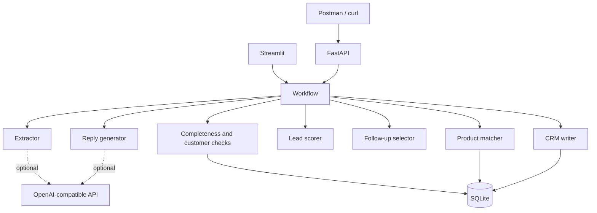

# System Architecture

## Key Decision

This is a modular monolith. Streamlit and FastAPI are two thin entry points over the same workflow. For a portfolio POC, message queues, a vector database, and a multi-agent runtime would add operational work without improving the core business proof.

## Reliability Pattern

The optional LLM path falls back to deterministic parsing or drafting on API, timeout, JSON, or validation failure. Pydantic creates a stable contract between language interpretation and rules. Product and score decisions do not depend on free-form model output.

## Production Evolution

A production version would place authentication and API boundaries around the workflow, use managed data stores, add observability, version prompts and rules, encrypt PII, and require an approval audit trail.
