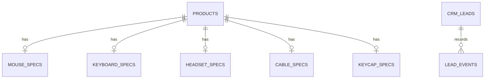

# Database Design

SQLite stores three bounded domains:

- Catalog: `products` plus one category-specific spec table per product family
- Customer context: `customers`
- Workflow records: `crm_leads` and `lead_events`

The main product table holds shared commercial attributes such as MOQ, prices, lead time, certifications, markets, and customization flags. Category tables keep technical fields typed and queryable without forcing unrelated sparse columns into one table.

Seed data is stored in CSV and loaded idempotently. Runtime CRM data is written to `gearlead.db`, which is ignored by Git.

