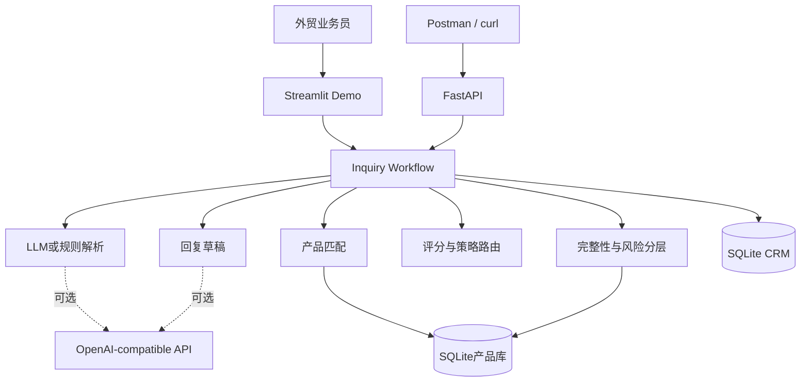

# AI解决方案设计

## 1. 方案目标

GearLead AI帮助电竞外设出口业务员完成首轮询盘处理：理解英文需求、查询产品、识别关键差距、判断跟进优先级并形成可审核的英文回复草稿。

方案不追求全自动销售，而是减少重复整理和查询工作，并让推荐依据与风险边界可见。

## 2. 目标流程（TO-BE）

```text
英文询盘
   ↓
LLM或规则解析器提取结构化需求
   ↓
Pydantic校验数据结构
   ↓
检查缺失信息、质量提醒和风险
   ↓
查询SQLite产品库并执行硬约束匹配
   ↓
计算线索得分并选择跟进策略
   ↓
生成英文回复草稿
   ↓
业务员审核、修改并保存CRM
```

## 3. 架构



## 4. 为什么采用混合方案

| 组件 | 职责 | 选择原因 |
|---|---|---|
| LLM | 理解开放式英文、生成自然回复 | 能处理语言变化和隐含表达 |
| Pydantic | 固定输入输出结构 | 防止自由文本直接进入业务规则 |
| SQLite | 保存SKU、客户记录和线索 | 产品参数是结构化事实，SQL更适合精确查询 |
| 简单规则 | 硬约束、风险路由、评分 | 关键商业判断需要稳定和可解释 |
| FastAPI | 对外提供业务能力 | 满足基础接口调用、调试和系统集成需求 |
| 人工审核 | 最终确认商业内容 | 防止错误价格、交期、认证和可行性承诺 |

## 5. 核心业务决策

### 产品硬约束

只有客户明确提出的关键参数才参与硬约束判断。

| 品类 | 关键硬约束示例 |
|---|---|
| 鼠标 | 连接方式、传感器、回报率 |
| 键盘 | 布局、连接方式、热插拔、语言布局 |
| 耳机 | 连接方式、平台兼容 |
| 线材 | 两端接口、航插类型 |
| 键帽 | 材质、工艺、Profile、物理布局 |

硬约束冲突时，系统只能返回ODM评估或无合适产品，不能返回标准SKU匹配。

### 风险分层

- 信息质量提醒：内容过短、只问最低价、关键字段缺失。
- 商业提醒：目标市场为推断值、独家合作缺少渠道信息、大额订单缺少企业资料。
- 风险信号：异常付款、索要敏感信息、绕过合同、已知高风险客户。

只有风险信号会强制进入人工风险复核。

### 地理字段

- 客户所在国用于客户画像。
- 目标市场用于认证和产品市场支持判断。
- 交付地点用于后续物流和报价准备。

若目标市场没有明确说明，POC可暂按客户所在国推断，但必须显示商业提醒并要求业务员确认。

## 6. FastAPI接口

| 方法 | 路径 | 用途 |
|---|---|---|
| GET | `/health` | 检查服务是否运行 |
| POST | `/api/v1/inquiries/analyze` | 提交询盘并返回完整分析 |
| GET | `/api/v1/products` | 按品类查询产品 |
| POST | `/api/v1/leads` | 保存审核后的线索 |
| GET | `/api/v1/leads` | 查询CRM线索 |

启动后访问`http://127.0.0.1:8000/docs`，可以在Swagger中直接查看和调试接口。

## 7. POC范围

### 包含

- 五类电竞外设和20个模拟SKU
- 英文文本、TXT和DOCX输入
- 结构化解析、产品匹配、评分、跟进和CRM保存
- Streamlit演示界面和FastAPI接口
- 25条合成回归询盘与关键业务反例测试

### 不包含

- 自动报价和自动发信
- 真实企业征信和贸易合规判断
- 真实库存、价格和认证文件
- 真实CRM、ERP和邮箱集成
- 复杂多Agent或生产级部署

## 8. 业务价值假设

试点阶段应观察：

- 首轮回复准备时间是否缩短
- 业务员对产品推荐的接受率
- 关键参数遗漏率是否下降
- 被业务员修改的字段和回复比例
- 需要工程或主管介入的询盘比例

本POC没有真实客户数据，因此不虚构ROI数字。它证明的是方案流程和技术可行性，实际价值需要在企业试点中测量。

## 9. 实施建议

1. 先由资深业务员确认字段、硬约束和风险定义。
2. 使用匿名真实询盘进行小规模验证。
3. 记录业务员修改内容，定位模型和规则问题。
4. 验证通过后再连接CRM或邮件草稿系统。
5. 保留人工审核，不直接自动发送商业回复。

